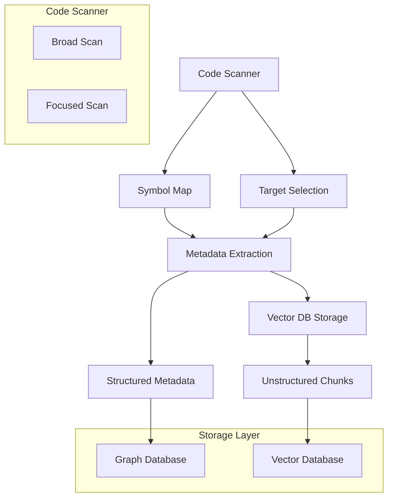
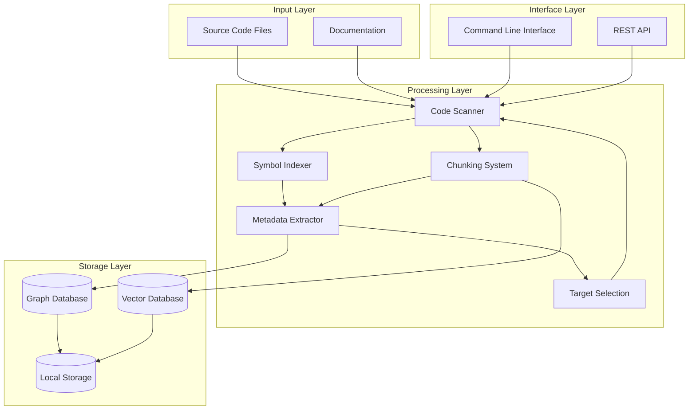
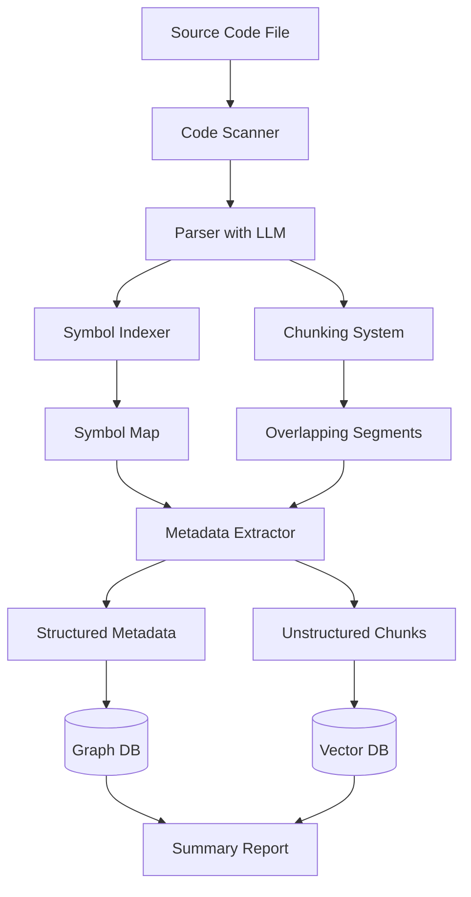
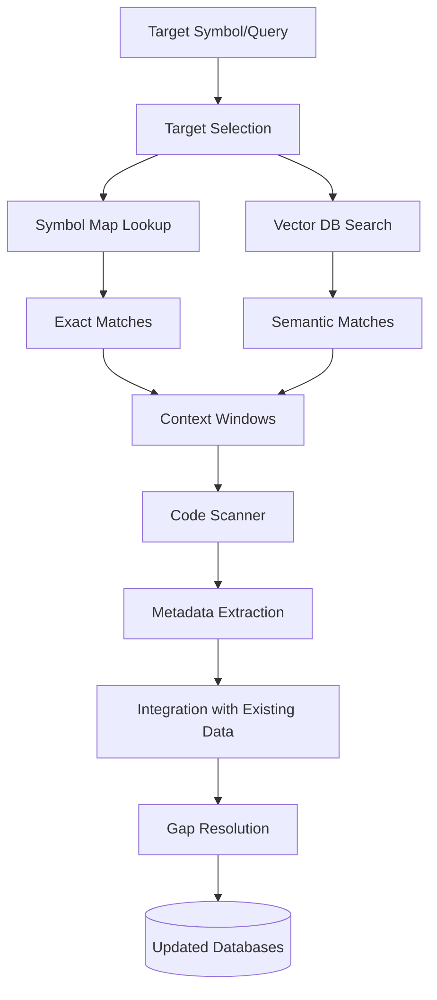
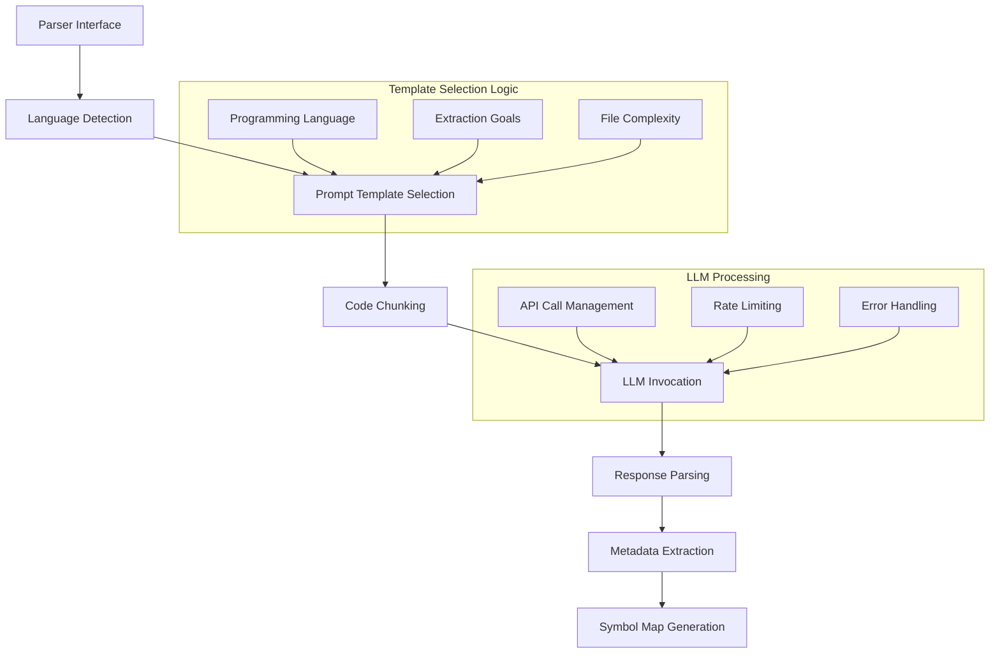
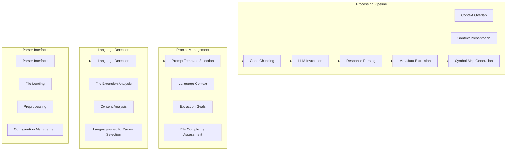
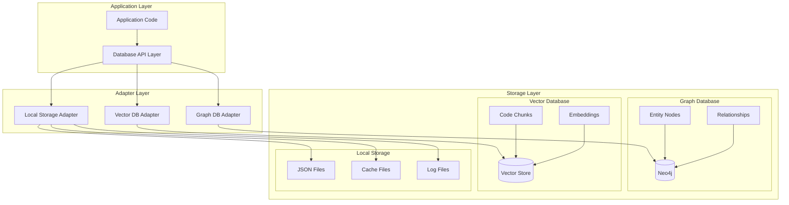
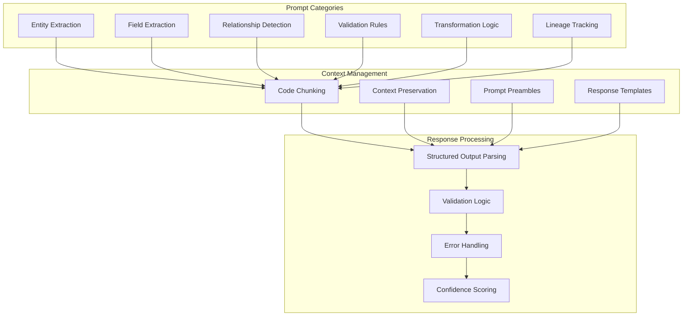
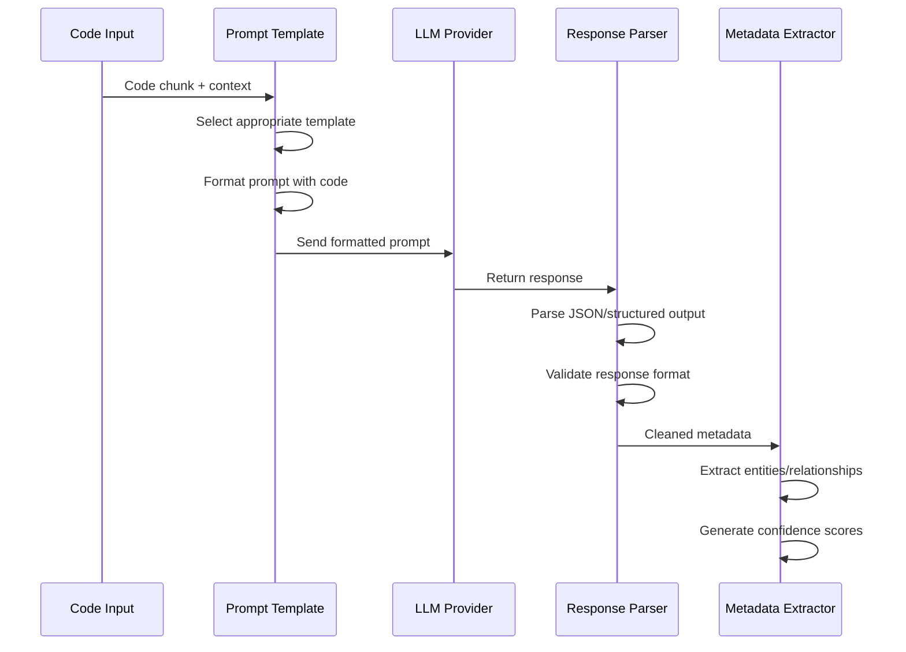

## NOTE: Superseded Document

**This document (`architecture.md`) outlines some earlier architectural ideas for the Metadata Code Extractor project. While some concepts may still be relevant at a high level, this document has been largely superseded by the more detailed and up-to-date component design documents and the `memory-bank/orchestration-architecture.md` file, which reflects the current agent-driven approach.**

Please refer to the following for the current architecture and design:
*   `memory-bank/orchestration-architecture.md` (for the overall agent-driven system flow)
*   `llm-orchestrator-agent-design.md`
*   `code-scanner-design.md`
*   `document-scanner-design.md`
*   `completeness-evaluator-design.md`
*   `llm-integration-design.md`
*   `database-integration-design.md`
*   `core-data-models.md`
*   And other specific design documents in the `memory-bank` or root design folder.

--- Original Content Below ---

# Metadata Code Extractor - Architecture

## System Architecture Overview



## High-Level Component Architecture



## Component Breakdown

### 1. Code Scanner
- **Purpose**: Entry point for processing source code files
- **Subcomponents**:
  - **Parser Interface**: Abstract interface for code parsing that leverages LLM with prompt templates
  - **Language-specific Parsers**: Implementations for different languages using LLM-based extraction with language-specific prompts
  - **Comment Extractor**: Pulls out comments and docstrings
  - **Scan Manager**: Coordinates the scanning process

### 2. Symbol Indexer
- **Purpose**: Creates mappings between symbols and their locations
- **Subcomponents**:
  - **Symbol Detector**: Identifies fields, methods, constants
  - **Location Tracker**: Records file and line positions
  - **Index Storage**: Persistent storage for the symbol map
  - **Lookup Service**: Fast retrieval of symbol locations

### 3. Metadata Extractor
- **Purpose**: Analyzes code to identify entities and relationships
- **Subcomponents**:
  - **Entity Recognizer**: Identifies classes, functions, etc.
  - **Attribute Analyzer**: Extracts types, defaults, etc.
  - **Relationship Detector**: Finds connections between entities
  - **Transformation Analyzer**: Identifies data transformations

### 4. Chunking System
- **Purpose**: Breaks code into manageable, overlapping segments
- **Subcomponents**:
  - **Chunker**: Splits code with appropriate overlap
  - **Embedding Generator**: Creates vector representations
  - **Chunk Storage**: Manages persistent storage of chunks

### 5. Target Selection
- **Purpose**: Identifies relevant code sections for focused scanning
- **Subcomponents**:
  - **Heuristic Engine**: Applies selection criteria
  - **Symbol Matcher**: Uses exact matching
  - **Semantic Matcher**: Uses similarity search

### 6. Database Adapters
- **Purpose**: Interfaces with external storage systems
- **Subcomponents**:
  - **Graph DB Client**: Stores structured metadata
  - **Vector DB Client**: Stores unstructured chunks
  - **Local Storage**: For standalone operation

## Data Flow

### Broad Scan Flow



### Focused Scan Flow



## Parser Implementation Approach

### LLM-Based Parser Structure



### Parser Component Details



### Key Parser Components

1. **Parser Interface**
   - Provides consistent API for all language parsers
   - Handles file loading and preprocessing
   - Manages parser configuration and settings

2. **Language Detection**
   - Identifies programming language from file extension or content
   - Selects appropriate language-specific parser 
   - Sets language-specific context for LLM prompts

3. **Prompt Template Selection**
   - Chooses appropriate prompt templates based on:
     - Programming language
     - Extraction goals (entities, fields, relationships)
     - File complexity and size

4. **Code Chunking**
   - Breaks code into manageable segments for LLM processing
   - Ensures appropriate overlap between chunks
   - Preserves context (imports, class definitions) for each chunk

5. **LLM Invocation**
   - Handles API calls to LLM provider
   - Manages rate limiting and error handling
   - Implements retry logic and timeout management

6. **Response Parsing**
   - Extracts structured data from LLM responses
   - Validates response format and content
   - Handles malformed or incomplete responses

7. **Metadata Extraction**
   - Transforms parsed LLM responses into metadata objects
   - Normalizes entity and field information
   - Resolves references between chunks

8. **Symbol Map Generation**
   - Creates indexed lookup for symbols
   - Maps symbols to file locations
   - Builds relationship graph between symbols

### Parser Implementation Strategy

The implementation will follow these steps:

1. Create abstract parser interface
2. Implement Python-specific parser as reference implementation
3. Design base prompt templates for common extraction tasks
4. Implement chunking strategy with context preservation
5. Build response parsing and validation system
6. Develop symbol map generation from extraction results
7. Add support for additional languages

## Database Architecture



## Key Interfaces

### Code Scanner Interface
```python
def scan_broad(file_path: str) -> ScanResult:
    """Process entire file to extract all metadata."""
    pass

def scan_targeted(file_path: str, focus: FocusConfig) -> ScanResult:
    """Process specific parts of a file based on focus criteria."""
    pass
```

### Symbol Index Interface
```python
def build(repo_root: str) -> SymbolMap:
    """Build symbol index for entire repository."""
    pass

def lookup(symbol: str) -> List[Location]:
    """Find all locations where symbol is defined or used."""
    pass
```

### Metadata Output Interface
```python
def output_structured_metadata(metadata: Dict) -> None:
    """Send structured metadata to graph database."""
    pass

def output_unstructured_chunks(chunks: List[TextChunk]) -> None:
    """Send unstructured text chunks to vector database."""
    pass
```

## Design Decisions

1. **LLM-Centric Approach**: Use LLM-based extraction as the primary method for metadata extraction, with static analysis as secondary support for structure optimization
2. **Pluggable Parser Architecture**: Support multiple languages through consistent interface
3. **Two-Tier Storage**: Separate structured (graph) and unstructured (vector) data
4. **Chunking Strategy**: ~40 lines with overlap for optimal context preservation
5. **Metadata Schema**: Consistent entity-relationship model across languages
6. **Standalone Operation**: Support local operation without external databases 

## LLM Prompt System

### Prompt Template Architecture



### Prompt Processing Flow



### Template Categories
1. **Entity Extraction Prompts**: For identifying data entities (classes, tables, models)
2. **Field Extraction Prompts**: For extracting fields, attributes, and their properties
3. **Relationship Detection Prompts**: For identifying connections between entities
4. **Validation Rule Prompts**: For extracting validation rules and constraints
5. **Transformation Logic Prompts**: For detecting data transformation patterns
6. **Lineage Tracking Prompts**: For inferring data flow and lineage

### Context Management Approach
- **Code Chunking**: Breaking code into segments with context overlap
- **Context Preservation**: Maintaining relevant imports and dependencies
- **Prompt Preambles**: Setting context for the LLM with file type and desired extraction
- **Response Templates**: Standardized output format for consistent parsing

### Response Processing
- **Structured Output Parsing**: JSON/YAML extraction from LLM responses
- **Validation Logic**: Consistency and sanity checks on extracted metadata
- **Error Handling**: Retry strategies and fallback mechanisms
- **Confidence Scoring**: Evaluating reliability of extracted information 

## Prompt Templates Design

### Entity Extraction Prompt Template
```
You are a code analyzer specializing in identifying data entities in {language} code.

CONTEXT:
{code_chunk}

TASK:
Identify all data entities (classes, data models, table definitions, etc.) in the provided code.
For each entity, extract:
1. Entity name
2. Entity type (class, enum, interface, etc.)
3. Description/purpose (from comments or code context)
4. Any parent/implementing classes
5. Location information (line numbers)

Format your response as valid JSON:
{
  "entities": [
    {
      "name": "string",
      "type": "string",
      "description": "string",
      "parents": ["string"],
      "line_start": number,
      "line_end": number
    }
  ]
}
```

### Field Extraction Prompt Template
```
You are a code analyzer specializing in extracting fields and their metadata in {language} code.

CONTEXT:
{code_chunk}

TASK:
For each field/attribute/property in the code:
1. Field name
2. Data type
3. Default value (if any)
4. Description (from comments)
5. Validation rules (if any)
6. Access modifiers (public, private, etc.)
7. Decorators/annotations
8. Parent entity (class it belongs to)

Format your response as valid JSON:
{
  "fields": [
    {
      "name": "string",
      "type": "string",
      "default_value": "string",
      "description": "string",
      "validations": ["string"],
      "access": "string",
      "decorators": ["string"],
      "parent_entity": "string"
    }
  ]
}
```

### Relationship Detection Prompt Template
```
You are a code analyzer specializing in detecting relationships between data entities in {language} code.

CONTEXT:
{code_chunk}

TASK:
Identify all relationships between data entities in the provided code.
For each relationship:
1. Source entity
2. Target entity
3. Relationship type (inheritance, composition, association, etc.)
4. Cardinality (one-to-one, one-to-many, etc.)
5. Field/property that establishes the relationship
6. Any constraints or annotations on the relationship

Format your response as valid JSON:
{
  "relationships": [
    {
      "source_entity": "string",
      "target_entity": "string",
      "type": "string",
      "cardinality": "string",
      "through_field": "string",
      "constraints": ["string"]
    }
  ]
}
```

### Lineage Tracking Prompt Template
```
You are a code analyzer specializing in tracking data lineage and transformations in {language} code.

CONTEXT:
{code_chunk}

TASK:
Identify data transformations and trace the lineage of data in the provided code.
For each transformation:
1. Source field/entity
2. Target field/entity
3. Transformation type (mapping, calculation, aggregation, etc.)
4. Transformation logic (formula, function, etc.)
5. Any conditions for the transformation

Format your response as valid JSON:
{
  "transformations": [
    {
      "source": "string",
      "target": "string",
      "type": "string",
      "logic": "string",
      "conditions": ["string"]
    }
  ]
}
``` 