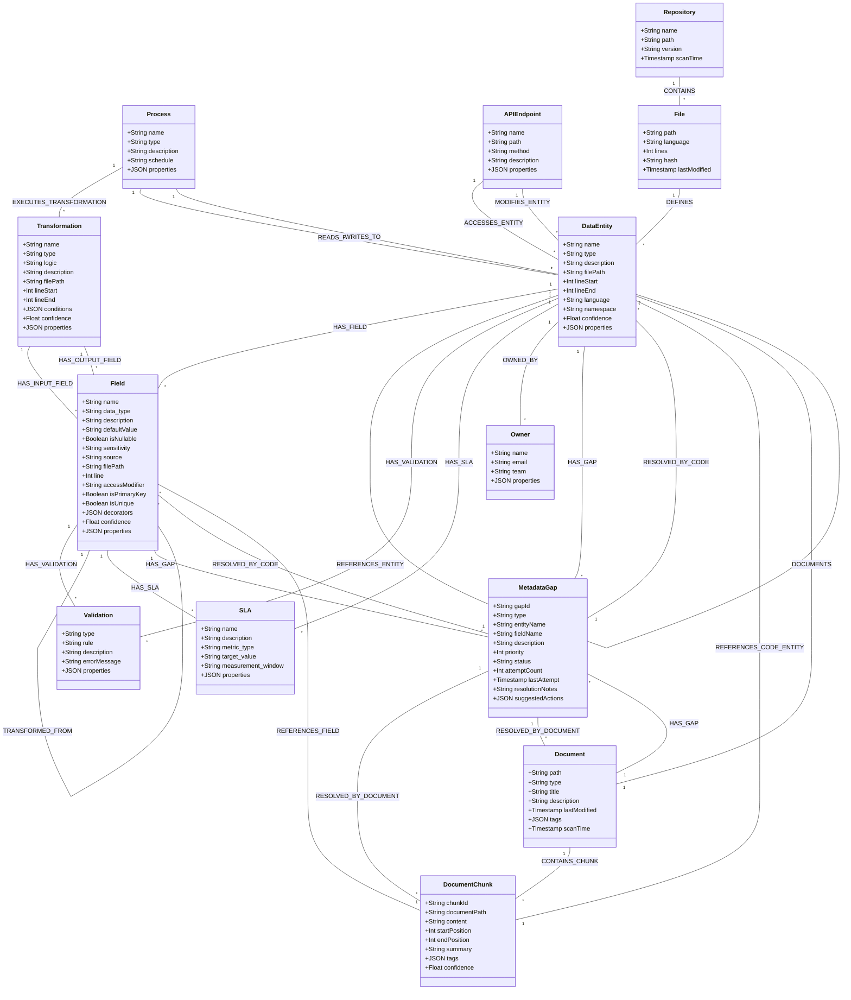

# Metadata Code Extractor - Graph Schema

## Graph Data Model Overview
The graph model captures metadata from code, documentation, and their relationships. It includes data entities, fields, validation rules, transformations, source files, repositories, documents, and metadata gaps. It also models processes, API endpoints, SLAs, and ownership to provide a comprehensive view of the data landscape.

## Node Types

### DataEntity
Represents a data structure definition such as a class, table, data model, enumeration, API, topic, etc.
**Key Properties:**
- `name` (string): Name of the entity (e.g., "Orders", "com.example.UserClass"). Might be qualified.
- `type` (string): Type of entity (e.g., "table", "class", "file_csv", "kafka_topic", "api_resource", "view").
- `description` (string): Description or purpose, extracted from comments or context.
- `filePath` (string): Path to the file where the entity is defined (if applicable).
- `lineStart` (integer): Starting line number in the source file (if applicable).
- `lineEnd` (integer): Ending line number in the source file (if applicable).
- `language` (string): Programming language or format (if applicable, e.g., "python", "sql", "json_schema").
- `namespace` (string): Namespace, package, or schema containing the entity.
- `confidence` (float): Confidence score for the extraction (0.0-1.0).
- `properties` (json): Additional properties as key-value pairs (e.g., table-specific like "primary_key_columns", class-specific like "superclasses").

### Field
Represents a field, attribute, property, or column within a DataEntity or API payload.
**Key Properties:**
- `name` (string): Name of the field (e.g., "order_id", "customerName").
- `data_type` (string): Data type of the field (e.g., "INT", "VARCHAR(100)", "boolean", "com.example.Address").
- `description` (string): Description or purpose, extracted from comments or context.
- `defaultValue` (string): Default value as a string representation.
- `isNullable` (boolean): Whether the field can be null.
- `sensitivity` (string): Data sensitivity classification (e.g., "PII", "Confidential", "Public").
- `source` (string): Original source system or field if this field is directly ingested/copied (can also be derived via lineage).
- `filePath` (string): Path to the file where the field is defined (if applicable).
- `line` (integer): Line number in the source file (if applicable).
- `accessModifier` (string): Access level (e.g., "public", "private", "protected") (if applicable).
- `isPrimaryKey` (boolean): Whether the field is part of a primary key (if applicable).
- `isUnique` (boolean): Whether the field has a uniqueness constraint (if applicable).
- `decorators` (json array): List of decorators or annotations (if applicable).
- `confidence` (float): Confidence score for the extraction (0.0-1.0).
- `properties` (json): Additional properties as key-value pairs.

### Validation
Represents a validation rule or constraint applied to a DataEntity or Field.
**Properties:**
- `name` (string, optional): Name of the validation rule (e.g., "OrderIdFormat").
- `type` (string): Type of validation (e.g., "range", "pattern", "length", "required", "uniqueness", "referential_integrity").
- `rule` (string): The validation rule expression or definition.
- `description` (string): Human-readable description of the validation.
- `errorMessage` (string): Error message associated with validation failure.
- `severity` (string, optional): Severity of the validation rule (e.g., "error", "warning").
- `properties` (json): Additional properties as key-value pairs.

### Transformation
Represents a data transformation operation or logic that derives fields or entities.
**Properties:**
- `name` (string, optional): Name or identifier for the transformation (e.g., "CalculateFullName", "AnonymizeEmail").
- `type` (string): Type of transformation (e.g., "mapping", "calculation", "aggregation", "join", "filter", "anonymization").
- `logic` (string): Logic or formula defining the transformation (e.g., a SQL expression, a code snippet, a business rule description).
- `description` (string): Description of the transformation purpose.
- `filePath` (string): Path to the file where the transformation is defined (if part of code).
- `lineStart` (integer): Starting line number in the source file.
- `lineEnd` (integer): Ending line number in the source file.
- `conditions` (json array): Conditions under which the transformation applies.
- `confidence` (float): Confidence score for the extraction (0.0-1.0).
- `properties` (json): Additional properties as key-value pairs.

### Process
Represents a data processing job, pipeline, or workflow.
**Properties:**
- `name` (string): Name of the process (e.g., "DailyOrderIngestion", "CustomerDataSync").
- `type` (string): Type of process (e.g., "batch_job", "streaming_pipeline", "manual_process", "api_driven_workflow").
- `description` (string): Description of the process's purpose and function.
- `schedule` (string, optional): Execution schedule or trigger (e.g., "daily at 2am", "on_event:NewOrder").
- `technology` (string, optional): Technology used (e.g., "Spark", "Airflow DAG", "Kafka Connect").
- `properties` (json): Additional properties as key-value pairs (e.g., `version`, `lastRunStatus`).

### APIEndpoint
Represents an API endpoint that interacts with data entities.
**Properties:**
- `name` (string): Logical name of the API endpoint (e.g., "GetUser", "CreateOrder").
- `path` (string): URL path of the endpoint (e.g., "/users/{id}", "/orders").
- `method` (string): HTTP method (e.g., "GET", "POST", "PUT", "DELETE").
- `description` (string): Description of the endpoint's purpose.
- `version` (string, optional): API version.
- `requestSchema` (json, optional): Schema definition for the request payload.
- `responseSchema` (json, optional): Schema definition for the response payload.
- `properties` (json): Additional properties as key-value pairs.

### SLA (Service Level Agreement)
Represents an SLA related to data entities or fields.
**Properties:**
- `name` (string): Name of the SLA (e.g., "OrderDataFreshnessSLA", "PIIFieldAccuracy").
- `description` (string): Detailed description of the SLA.
- `metric_type` (string): Type of metric being measured (e.g., "freshness", "completeness", "accuracy", "availability").
- `target_value` (string): The target value or condition for the metric (e.g., "< 1 hour old", "99.9% complete", ">= 99.95%").
- `measurement_window` (string, optional): Time window over which the metric is measured (e.g., "daily", "last 30 days").
- `consequence_of_breach` (string, optional): What happens if the SLA is breached.
- `properties` (json): Additional properties as key-value pairs.

### Owner
Represents the owner (person or team) of a data entity or process.
**Properties:**
- `name` (string): Name of the owner or owning team (e.g., "Jane Doe", "Sales BI Team").
- `email` (string, optional): Contact email for the owner.
- `team` (string, optional): Broader team or department.
- `role` (string, optional): Role of the owner (e.g., "Data Steward", "Product Owner").
- `properties` (json): Additional properties as key-value pairs.

### File
Represents a source code or data file.
**Properties:**
- `path` (string): Path to the file relative to repository root.
- `language` (string): Programming language or file type (e.g., "python", "sql", "csv", "json").
- `lines` (integer): Number of lines in the file.
- `hash` (string): Hash of file contents for change detection.
- `lastModified` (timestamp): Last modification timestamp.

### Repository
Represents a code repository or data store root.
**Properties:**
- `name` (string): Repository name.
- `path` (string): Path to repository root or connection string.
- `type` (string, optional): Type of repository (e.g., "git", "s3_bucket", "database_server").
- `version` (string): Version identifier (e.g., commit hash, tag, schema version).
- `scanTime` (timestamp): When the repository was last scanned.

### Document
Represents a documentation file or resource.
**Properties:**
- `path` (string): Path to the document relative to repository root or URL.
- `type` (string): Document type (e.g., "markdown", "pdf", "html", "confluence_page", "javadoc").
- `title` (string): Document title.
- `description` (string): Brief description of document content.
- `lastModified` (timestamp): Last modification timestamp.
- `tags` (json array): Content tags for categorization.
- `scanTime` (timestamp): When the document was scanned.

### DocumentChunk
Represents a segment of a document for vector storage and retrieval.
**Properties:**
- `chunkId` (string): Unique identifier for the chunk.
- `documentPath` (string): Path/URL to the parent document.
- `content` (string): The actual text content of the chunk.
- `startPosition` (integer): Start position in the document (e.g., line number, character offset).
- `endPosition` (integer): End position in the document.
- `summary` (string): AI-generated summary of the chunk.
- `tags` (json array): Content tags for the chunk.
- `confidence` (float): Confidence score for the extraction/relevance (0.0-1.0) of this chunk.

### MetadataGap
Represents a missing or incomplete piece of metadata identified by the system.
**Properties:**
- `gapId` (string): Unique identifier for the gap.
- `type` (string): Type of gap (e.g., "missing_description", "incomplete_relationship", "unknown_type", "undocumented_entity").
- `targetNodeId` (string, optional): ID of the node (DataEntity, Field, etc.) this gap primarily refers to.
- `targetNodeType` (string, optional): Type of the node this gap refers to.
- `description` (string): Detailed description of the missing information.
- `priority` (integer): Priority level for resolution (e.g., 1-High, 2-Medium, 3-Low).
- `status` (string): Current status (e.g., "open", "in_progress_semantic", "in_progress_targeted_code", "in_progress_targeted_doc", "resolved_auto", "resolved_manual", "requires_human_input", "failed_auto_resolution").
- `attemptCount` (integer): Number of automated resolution attempts made.
- `lastAttempt` (timestamp): Timestamp of the last resolution attempt.
- `resolutionNotes` (string): Notes about resolution attempts or guidance for human intervention.
- `suggestedActions` (json array): List of suggested actions (e.g., query VectorDB with specific terms, scan specific file, ask specific LLM prompt).

## Relationship Types

### Structural & Definitional
- **`CONTAINS`**
  - From: `Repository` To: `File`
  - Description: Indicates a repository contains a file.
- **`DEFINES`**
  - From: `File` To: `DataEntity` or `Transformation` or `Process`
  - Description: Indicates a file defines a code/data construct.
  - Properties: `definitionType` (string, e.g., "declaration", "implementation").
- **`HAS_FIELD`**
  - From: `DataEntity` To: `Field`
  - Description: Connects an entity to its constituent fields.
- **`INHERITS_FROM`**
  - From: `DataEntity` To: `DataEntity`
  - Description: Represents inheritance between entities (e.g., class inheritance).
  - Properties: `inheritanceType` (string, e.g., "extends", "implements").
- **`REFERENCES_ENTITY`**
  - From: `DataEntity` (or `Field`, `Process`, `Transformation`) To: `DataEntity`
  - Description: A generic reference relationship (e.g., foreign key, composition, association, dependency).
  - Properties: `referenceType` (string, e.g., "foreign_key", "composition", "uses_type"), `cardinality` (string, e.g., "one-to-one", "one-to-many").

### Validation & Rules
- **`HAS_VALIDATION`**
  - From: `DataEntity` or `Field` To: `Validation`
  - Description: Links an entity or field to its validation rules.
  - Properties: `scope` (string, "entity-level" or "field-level"), `priority` (integer).

### Data Lineage & Transformation
- **`TRANSFORMED_FROM`** (Direct Field Lineage)
  - From: `Field` To: `Field`
  - Description: Direct lineage showing one field is derived/transformed from another.
  - Properties: `transformationLogic` (string, optional, e.g., "CONCAT(source.colA, source.colB)"), `confidence` (float).
- **`HAS_INPUT_FIELD`**
  - From: `Transformation` To: `Field`
  - Description: Specifies an input field for a complex transformation.
- **`HAS_OUTPUT_FIELD`**
  - From: `Transformation` To: `Field`
  - Description: Specifies an output field from a complex transformation.
- **`EXECUTES_TRANSFORMATION`**
  - From: `Process` To: `Transformation`
  - Description: Indicates a process executes a specific transformation logic.
- **`READS_FROM`**
  - From: `Process` To: `DataEntity`
  - Description: A process reads data from a data entity.
  - Properties: `accessPattern` (string, e.g., "full_scan", "lookup").
- **`WRITES_TO`**
  - From: `Process` To: `DataEntity`
  - Description: A process writes data to a data entity.
  - Properties: `writeMode` (string, e.g., "overwrite", "append", "update").
- **`DERIVED_FROM`** (Entity Lineage - often via Process)
  - From: `DataEntity` To: `DataEntity`
  - Description: Denormalized or high-level lineage indicating one entity is derived from another. Often a result of a `Process`.
  - Properties: `derivationType` (string, e.g., "copy", "subset", "aggregation_via_process_X"), `confidence` (float).

### API Interaction
- **`ACCESSES_ENTITY`**
  - From: `APIEndpoint` To: `DataEntity`
  - Description: An API endpoint reads or accesses a data entity.
  - Properties: `accessType` (string, e.g., "read_only", "read_write").
- **`MODIFIES_ENTITY`**
  - From: `APIEndpoint` To: `DataEntity`
  - Description: An API endpoint creates, updates, or deletes data in an entity.
  - Properties: `modificationType` (string, e.g., "create", "update", "delete").

### Governance (SLA, Ownership)
- **`HAS_SLA`**
  - From: `DataEntity` or `Field` To: `SLA`
  - Description: Links a data element to its Service Level Agreement.
- **`OWNED_BY`**
  - From: `DataEntity` or `Process` To: `Owner`
  - Description: Assigns an owner to a data entity or process.

### Documentation Relationships
- **`DOCUMENTS`**
  - From: `Document` To: `DataEntity` or `Field` or `Process` or `APIEndpoint`
  - Description: Links a document to a system element it describes.
  - Properties: `documentationType` (string, e.g., "reference", "guide", "api_spec", "design_doc"), `confidence` (float).
- **`CONTAINS_CHUNK`**
  - From: `Document` To: `DocumentChunk`
  - Description: Links a document to its constituent chunks.
  - Properties: `position` (integer, order of the chunk).
- **`REFERENCES_CODE_ENTITY`**
  - From: `DocumentChunk` To: `DataEntity`
  - Description: Links a document chunk to a specific code entity it discusses or exemplifies.
  - Properties: `referenceType` (string, e.g., "mentions", "explains_details", "provides_example_for"), `confidence` (float).
- **`REFERENCES_FIELD`**
  - From: `DocumentChunk` To: `Field`
  - Description: Links a document chunk to a specific field it discusses.
  - Properties: `referenceType` (string, e.g., "defines", "explains_usage", "constraints"), `confidence` (float).

### Metadata Gap Tracking
- **`HAS_GAP`**
  - From: `DataEntity` or `Field` or `Document` (or other nodes like `Process`, `APIEndpoint`) To: `MetadataGap`
  - Description: Links an element to an identified metadata gap concerning it.
  - Properties: `identifiedAt` (timestamp), `gapSeverity` (string, e.g., "critical", "major", "minor").
- **`RESOLVED_BY_CODE`**
  - From: `MetadataGap` To: (`DataEntity` or `Field` or `Transformation` - generally a node derived from code)
  - Description: Indicates a gap was resolved by information extracted/inferred from code.
  - Properties: `resolutionTimestamp` (timestamp), `resolutionMethod` (string), `confidence` (float).
- **`RESOLVED_BY_DOCUMENT`**
  - From: `MetadataGap` To: (`DocumentChunk` or `Document`)
  - Description: Indicates a gap was resolved by information from a document.
  - Properties: `resolutionTimestamp` (timestamp), `resolutionMethod` (string), `confidence` (float).

## Query Examples
(Retain existing, and can add more later based on new nodes/relationships)

### Find all fields of a specific DataEntity
\`\`\`cypher
MATCH (e:DataEntity {name: 'User'})-[:HAS_FIELD]->(f:Field)
RETURN f.name, f.data_type, f.description
\`\`\`

### Find data lineage for a Field (direct and via Transformation)
\`\`\`cypher
// Direct
MATCH (f:Field {name: 'targetField'})-[:TRANSFORMED_FROM*]->(source:Field)
RETURN f.name AS target, source.name AS direct_source, source.data_type;

// Via Transformation
MATCH (target_field:Field {name: 'targetField'})<-[:HAS_OUTPUT_FIELD]-(tx:Transformation)-[:HAS_INPUT_FIELD]->(input_field:Field)
OPTIONAL MATCH (proc:Process)-[:EXECUTES_TRANSFORMATION]->(tx)
RETURN target_field.name AS target, input_field.name AS input_via_tx, tx.name AS transformation_name, proc.name AS process_name
\`\`\`

### Find Processes reading from or writing to a DataEntity
\`\`\`cypher
MATCH (p:Process)-[r:READS_FROM|WRITES_TO]->(de:DataEntity {name: 'CustomerOrders'})
RETURN p.name AS processName, type(r) AS interactionType, de.name AS entityName
\`\`\`

### Find APIs accessing a DataEntity
\`\`\`cypher
MATCH (api:APIEndpoint)-[r:ACCESSES_ENTITY|MODIFIES_ENTITY]->(de:DataEntity {name: 'ProductCatalog'})
RETURN api.name AS apiName, api.path AS apiPath, type(r) AS interactionType
\`\`\`

### Find unresolved critical MetadataGaps for DataEntities
\`\`\`cypher
MATCH (de:DataEntity)-[hg:HAS_GAP]->(gap:MetadataGap)
WHERE gap.status STARTS WITH 'open' OR gap.status = 'requires_human_input'
AND hg.gapSeverity = 'critical'
RETURN de.name AS entity_with_gap, gap.type AS gap_type, gap.description AS gap_description, gap.priority
ORDER BY gap.priority
\`\`\`

### Find documentation for a specific DataEntity
\`\`\`cypher
MATCH (doc:Document)-[:DOCUMENTS]->(de:DataEntity {name: 'UserRoles'})
OPTIONAL MATCH (doc)-[:CONTAINS_CHUNK]->(chunk:DocumentChunk)-[:REFERENCES_CODE_ENTITY]->(de)
RETURN doc.title AS document_title, doc.path AS document_path, कलेक्ट(chunk.summary) AS relevant_chunk_summaries
\`\`\`

## Implementation Notes
(Review and update these as needed)

1.  **Node Identifiers:**
    *   For `DataEntity`, `Field`, `Process`, `APIEndpoint`, `SLA`, `Owner`: Use a composite key or a UUID. A common pattern is `{type}:{name_or_path_hash}`. For example, `DataEntity:my.org.UserClass`, `Field:my.org.UserClass:userId`. Ensure uniqueness.
    *   `File`, `Document`: Path can serve as a primary key if normalized.
    *   `MetadataGap`: `gapId` should be a UUID.
    *   `DocumentChunk`: `chunkId` (e.g., `{documentPath_hash}:{startPosition}`) or UUID.
2.  **Confidence Scoring:** Apply to all LLM-extracted/inferred nodes and relationships.
3.  **Property Indexing:** Create indexes on frequently queried properties like `name`, `type`, `path`, `status`, `priority`, and `confidence`.
4.  **Graph Database Selection:** Neo4j is a strong candidate.
5.  **Schema Evolution:** Design for extensibility. Use JSON `properties` for less structured or evolving attributes. Version the core schema.
6.  **Timestamps:** Use ISO 8601 format for all timestamps. 