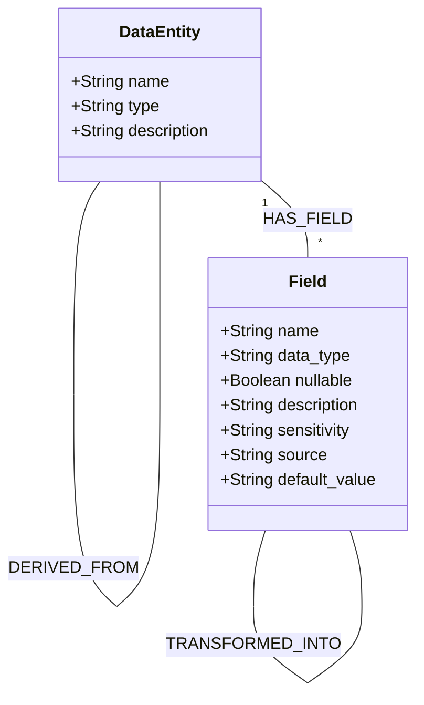

# Metadata Code Extractor - Graph Schema

## Graph Data Model Overview
The graph model captures metadata primarily about Data Entities and their Fields, and how they relate to each other. This version of the schema focuses on these two core node types. The graph database used is Neo4j.

## Node Types

### DataEntity
Definition: A Data Entity node represents a logical collection of data, typically a table in a database, a dataset, or a data object. Examples: a database table like "Orders", a file like "transactions.csv", or even a message topic.

Purpose: Captures metadata about data collections: how they relate to other data. Data Entities are central for data lineage – we trace how data flows from one Data Entity to another via processes or APIs.

Key Properties:
	•	`name` (String): Name of the data entity (e.g. "Orders" or "Invoice"). This might be qualified with a schema or namespace if needed (e.g. "sales.Orders").
	•	`type` (String): Type of data entity, e.g. "table", "file", "topic", "view".
	•	`description` (String): Description of what data it contains (e.g. "Stores customer orders with details like items, amount, status").

### Field
Definition: Represents a single field/attribute within a data entity (or potentially within an API payload). For a table, each column would be a Field node. For an API, we might also model request/response fields as Field nodes if we need fine-grained mapping (this can be optional; often for internal focus, we model database fields primarily).

Purpose: Allows capturing fine-grained metadata like data types, constraints, and field-level lineage (how one field is transformed into another across systems). Field nodes are useful for data quality rules and transformations.

Key Properties:
	•	`name` (String): The field name (e.g. "order_id", "amount", "status").
	•	`data_type` (String): Data type (e.g. "INT", "VARCHAR(100)", "Decimal" or in programming terms "Integer").
	•	`nullable` (Boolean): Whether the field can be null.
	•	`description` (String, optional): Description of the field's meaning.
	•	`sensitivity` (String, optional): Classification such as "PII", "Sensitive", "Confidential" if applicable.
	•	`source` (String, optional): If this field comes from another system or source originally (this can be derived via lineage, but sometimes noted in design).
	•	`default_value` (String, optional): Default value if any.

## Relationship Types

### Core Relationships
- **`HAS_FIELD`**
  - From: `DataEntity` To: `Field`
  - Description: Connects a Data Entity to its constituent Fields.
- **`BELONGS_TO`** (or `IN_ENTITY`)
  - From: `Field` To: `DataEntity`
  - Description: Indicates that a Field is part of a Data Entity. This is the inverse of `HAS_FIELD`.

### Data Entity Lineage
- **`DERIVED_FROM`** / **`FEEDS_INTO`**
  - From: `DataEntity` To: `DataEntity`
  - Description: Represents lineage between Data Entities. For example, an "Invoices" Data Entity might be derived from an "Orders" Data Entity. This relationship can be direct (denormalized) or represent a flow through an intermediate `Process` or `Transformation` (Note: `Process` and `Transformation` are conceptual in this schema version and not defined as explicit node types).
  - Properties: `method` (String, optional, e.g., "direct_copy", "via_BillingJob_process").

### Field Lineage
- **`TRANSFORMED_FROM`** / **`TRANSFORMED_INTO`**
  - From: `Field` To: `Field`
  - Description: Denotes lineage at the field level. For example, Field `full_name` might be transformed from Fields `first_name` and `last_name`.
  - Modeling Approaches:
    1.  **Direct Field-to-Field:** A direct relationship (e.g., `first_name -[:TRANSFORMED_INTO {rule: "concatenate with last_name"}]-> full_name`).
    2.  **Via Transformation Concept:** Conceptually, `first_name -[INPUT_TO]-> TransformationX`, `last_name -[INPUT_TO]-> TransformationX`, and then `TransformationX -[OUTPUT_TO]-> full_name`. (Note: `Transformation` is conceptual in this schema version and not defined as an explicit node type).
  - Properties: `rule` (String, optional, description of the transformation logic if direct), `transformation_concept_ref` (String, optional, reference to an external transformation definition).

### Relationships to Conceptual/External Entities
The following relationships link `DataEntity` or `Field` nodes to concepts or entities (e.g., `ValidationRule`, `Process`, `APIEndpoint`, `SLA`, `Owner`) that are not explicitly defined as node types in this focused schema. Their representation (e.g., as properties on `DataEntity`/`Field`, or as references to external systems/definitions) is outside the scope of the current explicit node definitions.

- **`VALIDATED_BY`**
  - From: `DataEntity` or `Field` To: Conceptual `ValidationRule`
  - Description: Links a DataEntity or Field to a validation rule that applies to it. The `ValidationRule` itself is not a defined node type in this schema; it might be represented as a string, JSON object within the node's properties, or an external reference.
  - Properties: `rule_definition` (String or JSON, describing the validation).
- **`USED_BY`**
  - From: Conceptual `Process` or `APIEndpoint` To: `DataEntity`
  - Description: Indicates that a Data Entity is read or used by a conceptual `Process` or `APIEndpoint`.
  - Note: To query this, you'd typically look for properties on `DataEntity` that might list its consumers, or query from the perspective of a `Process`/`APIEndpoint` if they were modeled.
- **`UPDATED_BY`**
  - From: Conceptual `Process` or `APIEndpoint` To: `DataEntity`
  - Description: Indicates that a Data Entity is written to or updated by a conceptual `Process` or `APIEndpoint`.
- **`HAS_SLA`**
  - From: `DataEntity` or `Field` To: Conceptual `SLA`
  - Description: Links a DataEntity or Field to a Service Level Agreement. The `SLA` is not a defined node type in this schema.
  - Properties: `sla_details` (String or JSON, describing the SLA).
- **`OWNED_BY`**
  - From: Conceptual `Owner` To: `DataEntity`
  - Description: Assigns an owner to a Data Entity. The `Owner` is not a defined node type in this schema.
  - Properties: `owner_info` (String or JSON, identifying the owner).
- **`USED_IN`**
  - From: `Field` To: Conceptual `APIEndpoint` or `Process`
  - Description: Denotes if a Field is used in some conceptual `APIEndpoint` or `Process`. Typically, usage is tracked at the `DataEntity` level or via transformations.

## Query Examples

### Find all fields of a specific DataEntity (Neo4j Cypher)
'''cypher
MATCH (e:DataEntity {name: 'Orders'})-[:HAS_FIELD]->(f:Field)
RETURN f.name, f.data_type, f.description
'''

### Find direct data lineage for a Field (Neo4j Cypher)
This query shows fields that `targetField` is directly transformed from.
'''cypher
MATCH (target:Field {name: 'targetField'})<-[:TRANSFORMED_INTO]-(source:Field)
RETURN target.name AS target_field, source.name AS source_field, source.data_type AS source_type
'''
Or, if using `TRANSFORMED_FROM`:
'''cypher
MATCH (target:Field {name: 'targetField'})-[:TRANSFORMED_FROM]->(source:Field)
RETURN target.name AS target_field, source.name AS source_field, source.data_type AS source_type
'''
(Note: For complex lineage involving intermediate transformation logic not captured by direct `Field-Field` relationships, a more elaborate model or querying approach referencing conceptual `Transformation` details would be needed.)

### Find Data Entities derived from a specific DataEntity (Neo4j Cypher)
'''cypher
MATCH (source_de:DataEntity {name: 'Orders'})-[:DERIVED_FROM|FEEDS_INTO*1..]->(derived_de:DataEntity)
RETURN source_de.name AS source_entity, derived_de.name AS derived_entity
'''

## Implementation Notes
1.  **Node Identifiers:**
    *   For `DataEntity`: Use a composite key like `{type}:{name}` ensuring uniqueness (e.g., `table:sales.Orders`).
    *   For `Field`: Use a composite key like `{data_entity_identifier}:{field_name}` (e.g., `table:sales.Orders:order_id`).
2.  **Property Indexing (Neo4j):** Create indexes on frequently queried properties:
    *   `DataEntity(name)`
    *   `DataEntity(type)`
    *   `Field(name)`
    *   `Field(data_type)`
3.  **Graph Database:** Neo4j is the selected graph database.
4.  **Schema Evolution:** This schema is focused. Future versions might expand it. Use JSON properties on nodes for less structured or evolving attributes if necessary, though the defined properties are preferred for clarity.
