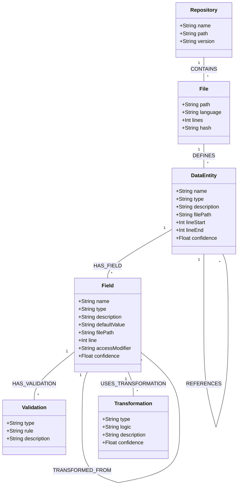

# Metadata Code Extractor - Graph Schema

## Graph Data Model



## Node Types

### DataEntity

Represents a data structure definition such as a class, table, data model, enumeration, etc.

**Properties:**
- `name` (string): Name of the entity
- `type` (string): Type of entity (e.g., "class", "table", "enum", "interface")
- `description` (string): Description or purpose, extracted from comments or context
- `filePath` (string): Path to the file where the entity is defined
- `lineStart` (integer): Starting line number in the source file
- `lineEnd` (integer): Ending line number in the source file
- `language` (string): Programming language of the implementation
- `namespace` (string): Namespace or package containing the entity
- `confidence` (float): Confidence score for the extraction (0.0-1.0)
- `properties` (json): Additional properties as key-value pairs

### Field

Represents a field, attribute, property, or column within a DataEntity.

**Properties:**
- `name` (string): Name of the field
- `type` (string): Data type of the field
- `description` (string): Description or purpose, extracted from comments
- `defaultValue` (string): Default value as a string representation
- `filePath` (string): Path to the file where the field is defined
- `line` (integer): Line number in the source file
- `accessModifier` (string): Access level (e.g., "public", "private", "protected")
- `isNullable` (boolean): Whether the field can be null
- `isPrimaryKey` (boolean): Whether the field is a primary key
- `isUnique` (boolean): Whether the field has a uniqueness constraint
- `decorators` (json array): List of decorators or annotations
- `confidence` (float): Confidence score for the extraction (0.0-1.0)
- `properties` (json): Additional properties as key-value pairs

### Validation

Represents a validation rule or constraint applied to a Field.

**Properties:**
- `type` (string): Type of validation (e.g., "range", "pattern", "length", "required")
- `rule` (string): The validation rule expression
- `description` (string): Human-readable description of the validation
- `errorMessage` (string): Error message associated with validation failure
- `properties` (json): Additional properties as key-value pairs

### Transformation

Represents a data transformation operation applied to Fields.

**Properties:**
- `type` (string): Type of transformation (e.g., "mapping", "calculation", "aggregation")
- `logic` (string): Logic or formula defining the transformation
- `description` (string): Description of the transformation purpose
- `filePath` (string): Path to the file where the transformation is defined
- `lineStart` (integer): Starting line number in the source file
- `lineEnd` (integer): Ending line number in the source file
- `conditions` (json array): Conditions under which the transformation applies
- `confidence` (float): Confidence score for the extraction (0.0-1.0)
- `properties` (json): Additional properties as key-value pairs

### File

Represents a source code file.

**Properties:**
- `path` (string): Path to the file relative to repository root
- `language` (string): Programming language
- `lines` (integer): Number of lines in the file
- `hash` (string): Hash of file contents for change detection
- `lastModified` (timestamp): Last modification timestamp

### Repository

Represents a code repository.

**Properties:**
- `name` (string): Repository name
- `path` (string): Path to repository root
- `version` (string): Version identifier (e.g., commit hash, tag)
- `scanTime` (timestamp): When the repository was scanned

## Relationship Types

### CONTAINS
- **From:** Repository
- **To:** File
- **Properties:** None

### DEFINES
- **From:** File
- **To:** DataEntity
- **Properties:**
  - `definitionType` (string): Type of definition (e.g., "declaration", "implementation")

### HAS_FIELD
- **From:** DataEntity
- **To:** Field
- **Properties:** None

### HAS_VALIDATION
- **From:** Field
- **To:** Validation
- **Properties:**
  - `priority` (integer): Execution priority if applicable

### INHERITS_FROM
- **From:** DataEntity
- **To:** DataEntity
- **Properties:**
  - `inheritanceType` (string): Type of inheritance (e.g., "extends", "implements")

### REFERENCES
- **From:** DataEntity
- **To:** DataEntity
- **Properties:**
  - `referenceType` (string): Type of reference (e.g., "composition", "association", "dependency")
  - `cardinality` (string): Cardinality of the relationship (e.g., "one-to-one", "one-to-many")

### TRANSFORMED_FROM
- **From:** Field
- **To:** Field
- **Properties:**
  - `transformationType` (string): Type of transformation
  - `confidence` (float): Confidence score for the relationship (0.0-1.0)

### USES_TRANSFORMATION
- **From:** Field
- **To:** Transformation
- **Properties:**
  - `order` (integer): Order of application if multiple transformations

### DERIVED_FROM
- **From:** DataEntity
- **To:** DataEntity
- **Properties:**
  - `derivationType` (string): How the entity is derived (e.g., "copy", "subset", "transformation")
  - `confidence` (float): Confidence score for the relationship (0.0-1.0)

## Query Examples

### Find all fields of a specific entity
```cypher
MATCH (e:DataEntity {name: 'User'})-[:HAS_FIELD]->(f:Field)
RETURN f.name, f.type, f.description
```

### Find data lineage for a field
```cypher
MATCH (f:Field {name: 'totalPrice'})-[:TRANSFORMED_FROM*]->(source:Field)
RETURN f.name, source.name, source.entity
```

### Find all entities implementing an interface
```cypher
MATCH (e:DataEntity)-[:INHERITS_FROM]->(interface:DataEntity {name: 'Serializable'})
RETURN e.name, e.type, e.filePath
```

### Find validation rules for a field
```cypher
MATCH (e:DataEntity {name: 'Product'})-[:HAS_FIELD]->(f:Field {name: 'price'})-[:HAS_VALIDATION]->(v:Validation)
RETURN f.name, v.type, v.rule, v.description
```

## Implementation Notes

1. **Node Identifiers**
   - Use composite keys for entities: `{name}_{filePath}`
   - Use composite keys for fields: `{entityName}_{name}_{filePath}`
   - This allows handling of similarly named entities across different files

2. **Confidence Scoring**
   - All LLM-extracted nodes and relationships should include confidence scores
   - Consider confidence threshold filtering in queries
   - Lower confidence items may require manual verification

3. **Property Indexing**
   - Create indexes on frequently queried properties:
     - DataEntity.name
     - Field.name
     - File.path
     - All confidence scores

4. **Graph Database Selection**
   - Primary recommendation: Neo4j (mature, widely used)
   - Alternatives: Amazon Neptune, JanusGraph, ArangoDB
   - Consider cloud-hosted options for easier deployment

5. **Schema Evolution**
   - Design for extensibility to add new node and relationship types
   - Use property-level extensions rather than schema changes when possible
   - Version the schema to track changes over time 