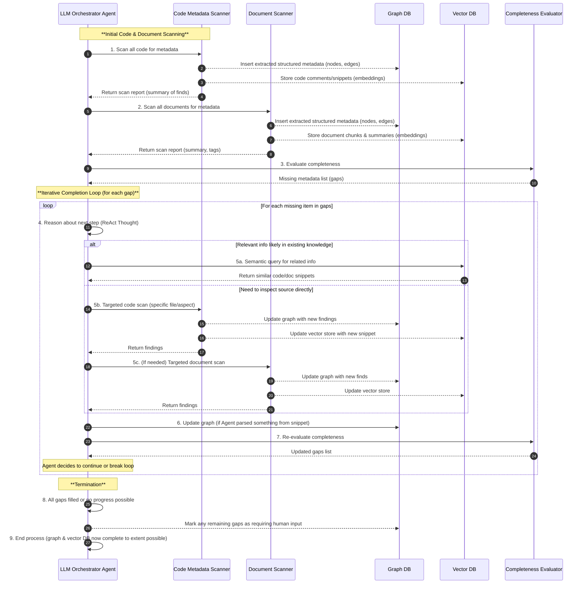

# Metadata Code Extractor - Orchestration Architecture

## Overview

The Metadata Code Extractor follows an orchestrated, agent-driven approach to metadata extraction, gap detection, and iterative completion. This architecture allows for more intelligent scanning, error recovery, and comprehensive metadata collection from both code and documentation sources. The system is coordinated by an LLM Orchestrator Agent that manages various specialized components to build a complete metadata graph.

## Component Interaction Flow

The following diagram illustrates the interaction between the core components:

## Key Components

### 1. LLM Orchestrator Agent
The central component responsible for coordinating the entire metadata extraction process.
- **Key Responsibilities:** Initiating scans, evaluating results, identifying gaps, directing targeted scans, reasoning about metadata, processing information, tracking progress, and termination.
- **Implementation Notes:** Uses ReAct (Reasoning + Acting) pattern, maintains state, uses LLM for reasoning.

### 2. Code Metadata Scanner
Specialized for extracting metadata from source code.
- **Key Responsibilities:** Broad and targeted code scans, LLM-based structured metadata extraction (entities, fields, relationships, transformations), graph conversion, vector embedding generation for code snippets/comments.
- **Implementation Notes:** Supports full repository and focused scans, uses language-specific prompts.

### 3. Document Scanner
Specialized for extracting metadata from documentation files (Markdown, PDF, HTML, etc.).
- **Key Responsibilities:** Scanning documents, extracting structured metadata, chunking for vector storage, generating summaries/tags, graph conversion.
- **Implementation Notes:** Understands various document formats, correlates document knowledge with code findings.

### 4. Graph Database Integration
Stores structured metadata.
- **Key Responsibilities:** Storing entities, fields, relationships, transformations, metadata provenance, supporting queries, tracking completeness.
- **Implementation Notes:** Uses schema from `graph-schema.md`, supports transactional updates, indexed for efficiency.

### 5. Vector Database Integration
Stores unstructured/semi-structured content for semantic search.
- **Key Responsibilities:** Storing code snippets, comments, document chunks, generating embeddings, supporting semantic search.
- **Implementation Notes:** Uses overlapping chunks, maintains source references, efficient similarity search.

### 6. Completeness Evaluator
Assesses metadata completeness and identifies gaps.
- **Key Responsibilities:** Evaluating extracted metadata, identifying missing/incomplete elements, prioritizing gaps, tracking progress, determining termination conditions.
- **Implementation Notes:** Defines completeness criteria, uses heuristics for gap prioritization, provides detailed gap descriptions.

## Workflow Phases

### Phase 1: Initial Scanning
1.  **Broad Code Scanning:** Agent initiates full code scan. Code Scanner extracts metadata, stores in Graph DB and Vector DB.
2.  **Documentation Scanning:** Agent initiates full document scan. Document Scanner extracts metadata, stores in Graph DB and Vector DB.
3.  **Initial Completeness Evaluation:** Completeness Evaluator assesses initial extraction and identifies gaps.

### Phase 2: Iterative Completion
1.  **Gap Analysis and Strategy:** Agent analyzes each gap and formulates a resolution plan.
2.  **Resolution Approaches:**
    *   **Semantic Search:** If info likely exists, Agent queries Vector DB.
    *   **Targeted Code Scan:** If direct code inspection needed, Agent directs Code Scanner.
    *   **Targeted Document Scan:** If docs might help, Agent directs Document Scanner.
3.  **Graph Updates:** Agent updates Graph DB with new findings.
4.  **Re-evaluation:** Completeness Evaluator reassesses, Agent decides to continue or break loop.

### Phase 3: Termination
1.  **Completion Determination:** All gaps filled, no progress, or confidence too low.
2.  **Final Graph Updates:** Remaining gaps marked for human review.
3.  **Process Completion:** Final metadata repository ready, summary report generated.

## Implementation Considerations
- **Orchestration Control Flow:** State-machine approach (Initialization, Broad Scanning, Gap Analysis, Gap Resolution, Completion).
- **Agent Decision Making:** ReAct (Thought, Action, Observation, Reflection) for traceable decisions.
- **Error Handling:** Scan failures (retry, partial results), Resolution failures (alternative strategies, confidence thresholds), Inconsistent metadata (confidence scoring, provenance).
- **Performance Optimization:** Caching (LLM responses, intermediate results), Parallelization (independent tasks), Prioritization (high-value metadata), Efficient LLM use (optimized context, fine-tuned prompts). 